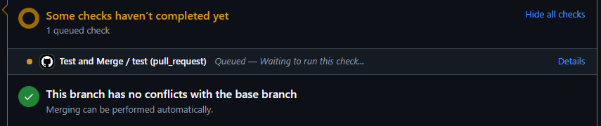
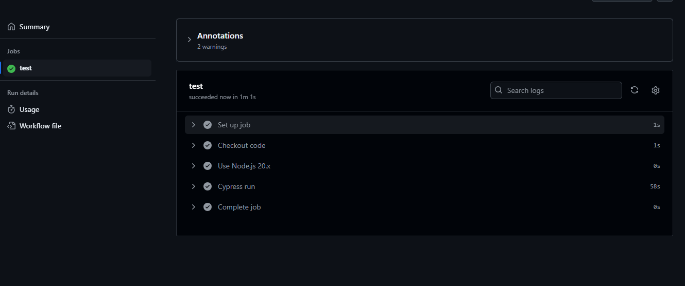

# CICD Pipeline

## Overview
Integrate CI/CD pipeline in a codebase using GitHub actions. a full stack application that runs test cases when a Pull Request is made to the develop branch 

## Functionality
- GitHub actions get triggered when Pull Request is submitted to a develop branch and Action executes Cypress component tests. all Cypress component test must pass 
- GitHub actions get triggered when Pull Request is submitted and merged to the main branch and action must automatically deploy the application to Render

## Actions 
Actions are defined inside the `main.yml` and `deploy.yml` files. The `on` portion specifies what should trigger the workflow.  

## Installation 

- Clone a repository 
  ```sh
      git clone git@github.com:sheetalmangate/CICD_Pipeline_Demo.git
  ```

- Create a new feature branch to make new pull request
  ```sh
      git checkout -b feature/test-cases
  ```

- Add and Commit the changes to newly created branch
  ```sh
        git add .
        git commit -m "Creating a PR for testing"
        git push origin feature/test-cases
  ```

- Open GitHub and navigate to the to Pull Request tab.
- Click on the "New Pull Request" button.
- In the "Compare" dropdown, choose the branch `feature/test-cases`.
- In the "base" dropdown, select the `develop` branch.
- Click on "Create pull request" to initiate the PR.
- Once the pull request is created, click on the "Details" link to view the status.
  
    

- Open Actions from GitHub to check the status.

    

## Questions
  For any question please reach out!

  - **Email** : [sheetal.mangate@gmail.com](sheetal.mangate@gmail.com)
  - **GitHub** : [sheetal](https://github.com/sheetalmangate) 

Thank you for your interest and feedback! 